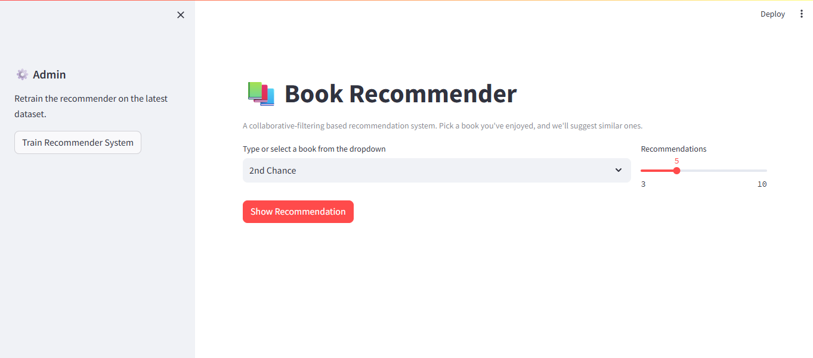
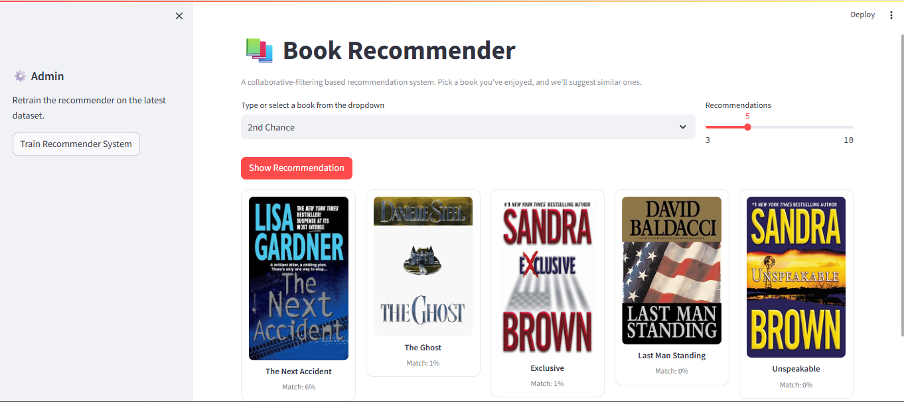
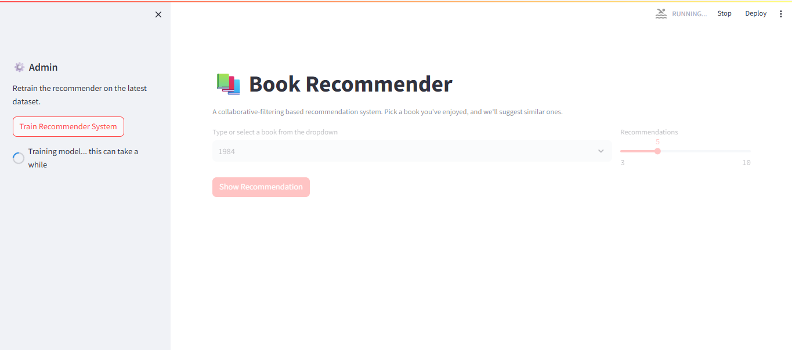
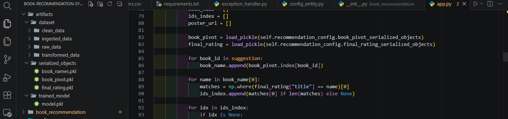
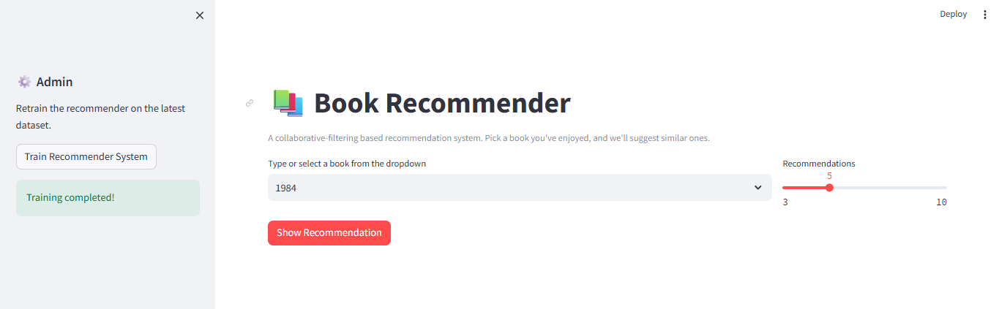

# 📚 Book Recommendation System

A **Collaborative Filtering** based book recommendation engine that suggests books similar to a user's selection. Built with a modular MLOps-inspired pipeline and deployed via an interactive Streamlit web app.

---

## � Screenshots

| Home Page | Recommendation Page |
|:---:|:---:|
|  |  |

| Training Page | Artifacts Created | Training Completed |
|:---:|:---:|:---:|
|  |  |  |


## �📖 Table of Contents

1. [What is this App About?](#-what-is-this-app-about)
2. [What is a Recommendation System?](#-what-is-a-recommendation-system)
3. [Types of Recommendation Systems](#-types-of-recommendation-systems)
4. [Collaborative Filtering — Deep Dive](#%EF%B8%8F-collaborative-filtering--deep-dive)
5. [Architecture — High Level Design (HLD)](#-architecture--high-level-design-hld)
6. [Architecture — Low Level Design (LLD)](#-architecture--low-level-design-lld)
7. [Concepts Used](#-concepts-used)
8. [Modular Coding Approach](#%EF%B8%8F-modular-coding-approach)
9. [Libraries Used & Why](#-libraries-used--why)
10. [How to Run the Project](#-how-to-run-the-project)

---

## 🧠 What is this App About?

This application allows a user to pick a book they have enjoyed from a dropdown, and it intelligently recommends **5–10 similar books** based on **user rating patterns** from the **Book-Crossing dataset** (BX-Books, BX-Book-Ratings, BX-Users).

### Key Features

| Feature | Description |
|---|---|
| **Book Selection** | Pick any book from a searchable dropdown of ~4,000+ popular titles. |
| **Intelligent Recommendations** | Uses collaborative filtering via the K-Nearest Neighbors algorithm to find similar books. |
| **Visual Poster Cards** | Each recommendation is displayed with a book cover image and a match-percentage score. |
| **Train on Demand** | Admins can retrain the model on the latest dataset from the sidebar. |
| **Modular Pipeline** | Fully modular data ingestion → validation → transformation → training pipeline. |

### Dataset Used

- **Source**: [Book-Crossing Dataset](http://www2.informatik.uni-freiburg.de/~cziegler/BX/) (compiled by Cai-Nicolas Ziegler)
- **Size**: ~278,858 users, ~271,379 books, ~1.1M ratings
- **Subset used**: Users who rated ≥200 books and books that received ≥50 ratings (to ensure statistical significance)

---

## 🎯 What is a Recommendation System?

A **Recommendation System** is a class of machine learning algorithms that predicts a user's preference for an item (book, movie, product, etc.) based on historical data. It helps users discover relevant items from a vast catalog by filtering out noise and surfacing personalized suggestions.

### Why do we need them?

- **Information Overload**: Help users navigate millions of items
- **Business Value**: Increase sales, engagement, and customer retention (Amazon's 35% revenue from recommendations, Netflix's 80% watched content from recommendations)
- **Personalization**: Tailor the experience to each user's unique taste

---

## 🗂️ Types of Recommendation Systems

```
┌────────────────────────────────────────────────────┐
│              RECOMMENDATION SYSTEMS                │
├──────────────┬──────────────┬─────────────────────┤
│              │              │                       │
│    Content   │  Collabo-    │    Hybrid             │
│    Based     │  rative      │    (Combination)      │
│              │  Filtering   │                       │
├──────────────┼──────────────┼─────────────────────┤
│ Uses item    │ Uses user    │ Merges both          │
│ attributes  │ behaviour   │ approaches for       │
│ (genre,      │ (ratings,   │ better accuracy      │
│ author,      │  clicks)    │ & cold-start         │
│ description) │             │ handling             │
├──────────────┼──────────────┼─────────────────────┤
│ Pros:        │ Pros:        │ Pros:                │
│ No cold-     │ No domain   │ Best accuracy,       │
│ start for    │ knowledge   │ solves cold-start    │
│ new items    │ required    │                      │
│ Cons:        │ Cons:        │ Cons:                │
│ Limited      │ Cold-start  │ Complex to build     │
│ serendipity  │ for new     │ & maintain           │
│              │ users/items │                      │
└──────────────┴──────────────┴─────────────────────┘
```

### 1. Content-Based Filtering
Recommends items **similar to what a user already liked** based on item metadata (genre, author, description, keywords). Example: "You liked *Harry Potter*, so you might like *Percy Jackson* (both fantasy young-adult)."

### 2. Collaborative Filtering (CF) ✅ *(Used in this project)*
Recommends items based on **patterns of user behaviour** across the community. It finds users (or items) with similar rating histories and bases recommendations on those similarities.

### 3. Hybrid Systems
Combines Content-Based and Collaborative approaches to overcome the limitations of each (e.g., Netflix uses a hybrid to handle new users/items).

---

## ⚙️ Collaborative Filtering — Deep Dive

This project uses **Item-Item Collaborative Filtering** with **K-Nearest Neighbors (KNN)**.

### How it works (Step-by-Step)

```
Step 1: Build User-Item Matrix
┌─────────┬────────┬────────┬────────┬───┐
│ User_ID │ Book_A │ Book_B │ Book_C │ … │
├─────────┼────────┼────────┼────────┼───┤
│ U_1     │   5    │   3    │   0    │ … │
│ U_2     │   4    │   0    │   0    │ … │
│ U_3     │   0    │   2    │   5    │ … │
│ U_4     │   1    │   1    │   4    │ … │
└─────────┴────────┴────────┴────────┴───┘

Step 2: Sparse Matrix Conversion
   ┌─────────────────────────────────┐
   │  Convert to csr_matrix from     │
   │  scipy.sparse for efficiency    │
   └─────────────────────────────────┘

Step 3: Fit KNN (brute-force)
   ┌─────────────────────────────────┐
   │ model = NearestNeighbors(       │
   │   algorithm='brute')            │
   │ model.fit(sparse_matrix)        │
   └─────────────────────────────────┘

Step 4: Query (given a book, find K nearest)
   ┌─────────────────────────────────┐
   │ distance, suggestion = model    │
   │   .kneighbors(book_pivot[       │
   │     book_id], n_neighbors=6)    │
   └─────────────────────────────────┘

Step 5: Return top-K (excluding itself)
   → Similarity scores displayed as %
```

### Why KNN with Brute Force?

| Aspect | Explanation |
|---|---|
| **Brute algorithm** | Computes distances against ALL training points → guaranteed exact nearest neighbors. Optimal for our dataset size (~4K books). |
| **Euclidean distance** | Measures "closeness" between books based on user-rating vectors. Lower distance = more similar. |
| **No train/test split** | KNN is a lazy learner — it "memorizes" the data and computes on query, so there's no explicit training phase. |

### Cold-Start Problem
- This system has a **cold-start for new books** — a book with zero ratings cannot be recommended. This is inherent to pure CF.
- A **Hybrid approach** (adding Content-Based signals) would solve this, which is a future improvement path.

---

## 🏗️ Architecture — High Level Design (HLD)

```
┌─────────────────────────────────────────────────────────────────────┐
│                        STREAMLIT WEB APP (app.py)                   │
│  ┌─────────────────────────────────────────────────────────────┐   │
│  │  User picks a book → clicks "Show Recommendation"           │   │
│  │  → Recommendation.recommend_book() is called                │   │
│  │  → Displays poster cards with match %                      │   │
│  │  Sidebar: "Train Recommender System" button                │   │
│  └─────────────────────────────────────────────────────────────┘   │
└─────────────────────────────────────────────────────────────────────┘
                                │
                                ▼
┌─────────────────────────────────────────────────────────────────────┐
│               TRAINING PIPELINE (TrainingPipeline)                  │
│                                                                     │
│  ┌──────────┐    ┌──────────┐    ┌──────────┐    ┌──────────┐      │
│  │  Step 1  │    │  Step 2  │    │  Step 3  │    │  Step 4  │      │
│  │  Data    │───▶│  Data    │───▶│  Data    │───▶│  Model   │      │
│  │Ingestion │    │Validation│    │Transform.│    │ Trainer  │      │
│  └──────────┘    └──────────┘    └──────────┘    └──────────┘      │
│       │               │               │               │            │
│       ▼               ▼               ▼               ▼            │
│  ┌──────────┐    ┌──────────┐    ┌──────────┐    ┌──────────┐      │
│  │Downloaded│    │ Cleaned  │    │ Pivot    │    │KNN Model │      │
│  │ ZIP from │    │ CSV with │    │ Table    │    │ pickle   │      │
│  │ GitHub   │    │ ratings &│───▶│(sparse)  │───▶│ .pkl     │      │
│  │          │    │ books    │    │ pickle   │    │          │      │
│  └──────────┘    └──────────┘    └──────────┘    └──────────┘      │
│                                                                     │
│  ┌──────────────────────────────────────────────────────────────┐   │
│  │  Serialized Objects for Web App: book_names, book_pivot,     │   │
│  │  final_rating → used by app.py at inference time             │   │
│  └──────────────────────────────────────────────────────────────┘   │
└─────────────────────────────────────────────────────────────────────┘
                                │
                                ▼
┌─────────────────────────────────────────────────────────────────────┐
│                     CONFIGURATION LAYER                             │
│                                                                     │
│  ┌──────────────────┐    ┌──────────────────────────────────┐       │
│  │   config.yaml    │───▶│  AppConfiguration class reads    │       │
│  │ (YAML file with  │    │  YAML → creates namedtuples for  │       │
│  │  all paths, URLs)│    │  each pipeline stage             │       │
│  └──────────────────┘    └──────────────────────────────────┘       │
└─────────────────────────────────────────────────────────────────────┘
```

### Data Flow Summary

```
[ZIP from GitHub] → [DataIngestion] → [raw CSV]
                                         ↓
[DataValidation] → clean_data.csv, final_rating.pkl (with user/ISBN/book merges)
                       ↓
[DataTransformation] → book_pivot.pkl (pivot table: books × users), book_names.pkl
                       ↓
[ModelTrainer] → model.pkl (KNN fitted on sparse pivot)
                       ↓
[Streamlit App] → Loads model + pivot + final_rating → Recommendations
```

---

## 🔧 Architecture — Low Level Design (LLD)

### Package Structure

```
📦 Book-Recommendation-System
├── 📄 app.py                              # Streamlit web application (frontend + inference)
├── 📄 main.py                             # Script to run training pipeline standalone
├── 📄 requirements.txt                    # Python dependencies
├── 📄 template.py                         # Project structure generator
├── 📄 .gitignore
├── 📖 README.md
│
├── 📂 config/
│   └── 📄 config.yaml                     # Central configuration (all paths, URLs)
│
├── 📂 artifacts/                          # Generated during training
│   ├── 📂 dataset/                        # Raw + processed data
│   │   ├── 📂 raw_data/                   # Downloaded ZIP
│   │   ├── 📂 ingested_data/              # Extracted CSVs
│   │   ├── 📂 clean_data/                 # Cleaned CSVs
│   │   └── 📂 transformed_data/          # Pivot table pickle
│   ├── 📂 serialized_objects/            # book_names.pkl, book_pivot.pkl, final_rating.pkl
│   └── 📂 trained_model/                 # model.pkl
│
├── 📂 notebook/
│   ├── 📄 BX-Books.csv
│   ├── 📄 BX-Book-Ratings.csv
│   ├── 📄 BX-Users.csv
│   └── 📄 recommend.ipynb                # Jupyter experiment notebook
│
└── 📂 book_recommendation/                # Main Python package
    ├── 📄 __init__.py
    │
    ├── 📂 config/
    │   └── 📄 configuration.py           # AppConfiguration class (reads YAML, creates config)
    │
    ├── 📂 constant/
    │   └── 📄 __init__.py                # ROOT_DIR, CONFIG_FILE_PATH constants
    │
    ├── 📂 entity/
    │   └── 📄 config_entity.py           # Namedtuples: DataIngestionConfig, etc.
    │
    ├── 📂 components/
    │   ├── 📄 step_01_data_ingestion.py   # Download ZIP, extract CSVs
    │   ├── 📄 step_02_data_validation.py  # Clean, merge, filter ratings, save
    │   ├── 📄 step_03_data_transformation.py  # Pivot table, serialize objects
    │   └── 📄 step_04_model_trainer.py    # Train KNN, save model
    │
    ├── 📂 pipeline/
    │   └── 📄 training_pipeline.py        # Orchestrator for all 4 steps
    │
    ├── 📂 utils/
    │   └── 📄 util.py                     # read_yaml_file helper
    │
    ├── 📂 exception/
    │   └── 📄 exception_handler.py        # Custom AppException class
    │
    └── 📂 logger/
        └── 📄 log.py                      # Logging configuration
```

### Class & Data Flow Diagram (Sequence)

```
┌──────────┐    ┌──────────┐    ┌──────────────┐    ┌────────────┐
│   User   │    │ Streamlit│    │ Recommendation│   │ Training   │
│ (Browser)│    │  App     │    │   Engine      │   │ Pipeline   │
└────┬─────┘    └────┬─────┘    └──────┬───────┘   └─────┬──────┘
     │                │                 │                  │
     │  Select book   │                 │                  │
     │────────────────▶│                 │                  │
     │                 │                 │                  │
     │                 │  recommend_book │                  │
     │                 │────────────────▶│                  │
     │                 │                 │                  │
     │                 │   kneighbors()  │                  │
     │                 │   on KNN model  │                  │
     │                 │◀────────────────│                  │
     │                 │                 │                  │
     │  Show posters   │                 │                  │
     │◀────────────────│                 │                  │
     │                 │                 │                  │
     │  Click Train    │                 │                  │
     │────────────────▶│                 │                  │
     │                 │  train_engine()  │                 │
     │                 │────────────────▶│                  │
     │                 │                 │  start_training  │
     │                 │                 │──────────────────▶│
     │                 │                 │                  │
     │                 │                 │  Step 1: Ingest  │◀── download ZIP
     │                 │                 │  Step 2: Validate│◀── clean & merge
     │                 │                 │  Step 3: Transform│◀── pivot table
     │                 │                 │  Step 4: Train   │◀── KNN fit
     │                 │                 │                  │
     │                 │  Success msg    │                  │
     │◀────────────────│◀────────────────│◀─────────────────│
```

### Configuration Management

```yaml
# config/config.yaml
artifacts_config:
  artifacts_dir: artifacts

data_ingestion_config:
  dataset_download_url: <URL to ZIP>
  dataset_dir: dataset
  ingested_dir: ingested_data
  raw_data_dir: raw_data

data_validation_config:
  clean_data_dir: clean_data
  serialized_objects_dir: serialized_objects
  books_csv_file: BX-Books.csv
  ratings_csv_file: BX-Book-Ratings.csv

data_transformation_config:
  transformed_data_dir: transformed_data

model_trainer_config:
  trained_model_dir: trained_model
  trained_model_name: model.pkl
```

The **AppConfiguration** class reads this YAML and produces typed **namedtuple** config objects:

```python
DataIngestionConfig(dataset_download_url, raw_data_dir, ingested_dir)
DataValidationConfig(clean_data_dir, books_csv_file, ratings_csv_file, serialized_objects_dir)
DataTransformationConfig(clean_data_file_path, transformed_data_dir)
ModelTrainerConfig(transformed_data_file_dir, trained_model_dir, trained_model_name)
ModelRecommendationConfig(book_name_serialized_objects, book_pivot_serialized_objects,
                          final_rating_serialized_objects, trained_model_path)
```

### Data Validation Logic (Key Filtering)

```python
# 1. Keep only users who rated ≥200 books
x = ratings['user_id'].value_counts() > 200
y = x[x].index
ratings = ratings[ratings['user_id'].isin(y)]

# 2. Merge ratings with books on ISBN
ratings_with_books = ratings.merge(books, on='ISBN')

# 3. Keep only books with ≥50 ratings (popularity filter)
final_rating = final_rating[final_rating['num_of_rating'] >= 50]

# 4. Drop duplicate (user_id, title) pairs
final_rating.drop_duplicates(['user_id','title'], inplace=True)
```

### Data Transformation (Pivot Table)

```python
# Creates a matrix: rows=books, columns=users, values=ratings (0=unrated)
book_pivot = df.pivot_table(columns='user_id', index='title', values='rating')
book_pivot.fillna(0, inplace=True)  # Sparse representation
```

### Model Training (KNN)

```python
from sklearn.neighbors import NearestNeighbors
from scipy.sparse import csr_matrix

book_sparse = csr_matrix(book_pivot)
model = NearestNeighbors(algorithm='brute')
model.fit(book_sparse)
```

### Inference in Streamlit

```python
# Given a book name, get its vector from pivot table
book_id = np.where(book_pivot.index == book_name)[0][0]

# Find K nearest neighbours (K+1 because item itself is at distance 0)
distance, suggestion = model.kneighbors(
    book_pivot.iloc[book_id, :].values.reshape(1, -1),
    n_neighbors=n_recommendations + 1
)

# Fetch posters and display with similarity score
for i in range(len(suggestion)):
    similarity = 1 - (distance / max_distance)  # Normalised to 0–100%
```

---

## 🧩 Concepts Used

### 1. Modular Programming
- **Separation of Concerns**: Each pipeline step has its own class and file
- **Single Responsibility**: `DataIngestion` only downloads/extracts; `DataValidation` only cleans; etc.
- **Reusability**: Components can be used independently or in different pipelines

### 2. Configuration-Driven Architecture
- All parameters (paths, URLs) live in `config.yaml` — no hardcoded values
- Changes require only YAML modifications, not code changes
- `AppConfiguration` class centralizes config reading

### 3. Custom Exception Handling
```python
class AppException(Exception):
    # Captures file name + line number of the error source
    # Makes debugging faster — no need to trace back through logs
```
- Wraps every `except` block with `raise AppException(e, sys) from e`
- Provides **file name** and **line number** where the error occurred

### 4. Logging Framework
- Timestamped log files in `logs/` directory
- Consistent format: `[timestamp] logger_name - LEVEL - message`
- Helps track pipeline execution and debug issues

### 5. Pipeline Orchestration
- `TrainingPipeline` class chains the 4 components in sequence
- Each component's `initiate_*` method logs start/end markers
- Makes the training process **deterministic** and **reproducible**

### 6. Pickle Serialization
- Intermediate artifacts (pivot table, cleaned data, trained model) saved as `.pkl` files
- Allows the Streamlit app to load pre-trained artifacts without retraining
- Enables separation of training time and inference time

### 7. Streamlit Caching
```python
@st.cache_resource(show_spinner=False)
def load_pickle(path):
    with open(path, "rb") as f:
        return pickle.load(f)
```
- Loads pickled objects **once per session** — avoids repeated disk I/O
- Dramatically improves UI responsiveness

### 8. Sparse Matrix Representation
```python
from scipy.sparse import csr_matrix
book_sparse = csr_matrix(book_pivot)
```
- The pivot table is mostly zeros (most users haven't rated most books)
- CSR (Compressed Sparse Row) format saves memory and speeds up KNN computation

### 9. Collaborative Filtering via KNN
- **Item-Item CF**: Computes similarity between books based on user rating vectors
- **KNN query**: Returns top-K most similar books for the selected book

---

## 🧱 Modular Coding Approach

### Why Modular?

| Problem | Solution in this Project |
|---|---|
| Monolithic code is hard to maintain | Each responsibility → separate file/class |
| Hard to test individual parts | Each component can be instantiated & tested in isolation |
| Configuration scattered in code | Centralized config.yaml + AppConfiguration |
| Error debugging is slow | Custom AppException with file/line tracking |
| Pipeline changes break everything | TrainingPipeline orchestrates; components are independent |
| Reproducibility is hard | All artifacts versioned via config paths, logs timestamped |

### Module Dependency Graph

```
config/config.yaml
        │
        ▼
AppConfiguration (reads YAML → produces namedtuple configs)
        │
        └──────────────────────────────────────────────────────────┐
        │        │            │              │                    │
        ▼        ▼            ▼              ▼                    ▼
DataIngestion  DataValidation  DataTransformation  ModelTrainer  Streamlit App
  (step_01)      (step_02)        (step_03)         (step_04)      (app.py)
        │        │            │              │                    │
        └────────┴────────────┴──────────────┴────────────────────┘
                                    │
                           TrainingPipeline
                           (orchestrator)
```

---

## 📦 Libraries Used & Why

| Library | Version | Purpose & Why |
|---|---|---|
| **streamlit** | latest | **Web UI framework**. Builds interactive data apps with pure Python. No HTML/CSS/JS needed. Used for the recommendation frontend — dropdown, slider, poster cards. |
| **scikit-learn** | latest | **Machine learning library**. Provides `NearestNeighbors` class — the core KNN algorithm for collaborative filtering. Also provides utility functions for distance metrics. |
| **pandas** | latest | **Data manipulation**. Loads CSV files (`read_csv`), cleans & merges data (`merge`, `groupby`, `pivot_table`), filters users/books by threshold. Backbone of data validation & transformation. |
| **numpy** | latest | **Numerical computing**. Used for array operations (`np.where` to find book indices, array indexing). Powers the KNN distance computations under the hood. |
| **PyYAML** | latest | **YAML parser**. Reads `config/config.yaml` — the central configuration file with all paths, URLs, and directory names. `yaml.safe_load()` returns a dictionary. |
| **scipy** | (via sklearn) | **Sparse matrices**. `csr_matrix` converts the dense pivot table to Compressed Sparse Row format — critical for memory efficiency with the large user×book matrix. Also used by sklearn internally. |
| **pickle** | (stdlib) | **Object serialization**. Saves trained model, pivot table, book names, and final_rating as `.pkl` files. Streamlit app loads these at inference time. Standard library — no extra dependency. |

### Why these libraries?

```
┌─────────────────────────────────────────────────────────────────┐
│  streamlit:  "Fastest way to turn Python scripts into web apps"│
│              - 0 lines of frontend code needed                  │
│              - Built-in caching, widgets, layout                │
├─────────────────────────────────────────────────────────────────┤
│  scikit-learn: "Industry-standard ML library"                   │
│              - NearestNeighbors with brute algorithm            │
│              - Well-tested, optimized, documented               │
├─────────────────────────────────────────────────────────────────┤
│  pandas:      "Excel on steroids for Python"                    │
│              - pivot_table → user×book matrix                   │
│              - merge, groupby, value_counts → data cleaning     │
├─────────────────────────────────────────────────────────────────┤
│  numpy:       "Foundation of scientific Python"                 │
│              - Fast array operations                            │
│              - sklearn & pandas both built on numpy             │
├─────────────────────────────────────────────────────────────────┤
│  PyYAML:      "Read configuration from YAML"                    │
│              - human-readable config format                     │
│              - Changes without touching code                    │
├─────────────────────────────────────────────────────────────────┤
│  scipy.sparse: "Handle large sparse matrices efficiently"       │
│              - CSR format: O(nnz) memory vs O(n²) for dense    │
│              - Essential for KNN on user×book matrix            │
└─────────────────────────────────────────────────────────────────┘
```

---

## 🚀 How to Run the Project

### 1. Setup Environment

```bash
conda create --name recommend python=3.12.4 -y
conda activate recommend
```

### 2. Install Dependencies

```bash
pip install -r requirements.txt
```

### 3. Train the Model (Optional — required first time)

```bash
python main.py
```

This will:
- Download the dataset ZIP from GitHub
- Extract and clean the data
- Build the pivot table
- Train the KNN model
- Save all artifacts to `artifacts/`

### 4. Run the Web App

```bash
streamlit run app.py
```

- Pick a book from the dropdown
- Adjust the slider for number of recommendations (3–10)
- Click **"Show Recommendation"**
- Optionally, use the sidebar **"Train Recommender System"** to retrain

---

## 🔮 Future Improvements

| Area | Potential Enhancement |
|---|---|
| **Cold Start** | Add content-based features (genre, author embeddings) to create a hybrid system |
| **Performance** | Use `algorithm='ball_tree'` or `'kd_tree'` for faster queries on larger datasets |
| **User-based CF** | Also provide "Users who liked X also liked Y" recommendations |
| **Better UI** | Add book author, year, and description to the recommendation cards |
| **Dockerization** | Package the app in a Docker container for easy deployment |
| **A/B Testing** | Compare KNN vs Matrix Factorization (SVD) for recommendation quality |

---

## 📝 License & Credits

- **Dataset**: Book-Crossing Dataset by Cai-Nicolas Ziegler
- **Architecture inspiration**: Modular MLOps pipeline patterns (config-driven, component-based)
- **Built with**: Streamlit, scikit-learn, pandas, numpy